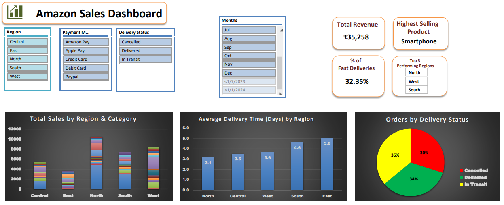

# 📊 Amazon Sales & Delivery Performance Dashboard

An interactive **Excel dashboard project** focused on analyzing Amazon sales, delivery performance, cancellations, and regional trends to support **smart business decision-making**.

---

<h2 id="toc">📌 Table of Contents</h2>

<ul>
<li><a href="#project-overview">Project Overview</a></li>
<li><a href="#tools-skills">Tools & Skills Used</a></li>
<li><a href="#dashboard-preview">Dashboard Preview</a></li>
<li><a href="#insights">Key Business Insights</a></li>
<li><a href="#project-files">Project Files</a></li>
<li><a href="#how-to-use">How to Use</a></li>
<li><a href="#author">Author</a></li>
</ul>

---

<h2 id="project-overview">📘 Project Overview</h2>

<p>
This project demonstrates how <b>Advanced Excel</b> can be used as a powerful analytics and business intelligence tool.
</p>

<p>
Using real-world styled Amazon sales data, the dashboard provides a clear view of:
</p>

<ul>
<li>Sales performance</li>
<li>Delivery efficiency</li>
<li>Regional contribution</li>
<li>Order cancellations</li>
<li>Top-selling products</li>
</ul>

<p>
The goal is to convert raw data into <b>actionable insights</b> using Excel features like Pivot Tables, Pivot Charts, XLOOKUP, and interactive slicers.
</p>

---

<h2 id="tools-skills">🛠 Tools & Skills Used</h2>

<ul>
<li>Microsoft Excel</li>
<li>Pivot Tables & Pivot Charts</li>
<li>XLOOKUP</li>
<li>Data Cleaning & Structuring</li>
<li>KPI Design</li>
<li>Interactive Slicers & Filters</li>
<li>Dashboard Layout & Storytelling</li>
</ul>

---

<h2 id="dashboard-preview">📊 Dashboard Preview</h2>

### 🔹 Overview Dashboard



### 🔹 Insights Dashboard


---

<h2 id="insights">🔍 Key Business Insights</h2>

<ul>
<li>Identified high-performing regions contributing the most to total sales</li>
<li>Analyzed delivery performance and cancellation patterns</li>
<li>Compared order volume vs effective sales across regions</li>
<li>Highlighted top-selling products driving revenue</li>
<li>Enabled month-wise, region-wise, and delivery-status analysis using slicers</li>
</ul>

---

<h2 id="project-files">📁 Project Files</h2>

```
Amazon-Sales-Excel-Dashboard/
│
├── Amazon_Sales_Dashboard.xlsx
├── Amazon_Sales_Dashboard.pdf
│
├── Images/
│   ├── Dashboard_Overview.png
│   └── Dashboard_Insights.png
│
└── README.md
```

---

<h2 id="how-to-use">🚀 How to Use</h2>

<ol>
<li>Download the Excel file</li>
<li>Open <code>Amazon_Sales_Dashboard.xlsx</code></li>
<li>Use slicers to filter data by:
  <ul>
    <li>Month</li>
    <li>Region</li>
    <li>Delivery Status</li>
    <li>Payment Mode</li>
  </ul>
</li>
<li>Analyze KPIs and charts for insights</li>
</ol>

---

<h2 id="author">👤 Author</h2>

<p>
<b>Nitish Sharma</b><br>
📧 Email: nitishsharma.id@gmail.com<br>
🔗 GitHub: https://github.com/NitishSharma77<br>
🔗 LinkedIn: https://www.linkedin.com/in/nitish-sharma7
</p>

---

⭐ If you found this project useful, feel free to give the repository a star!
